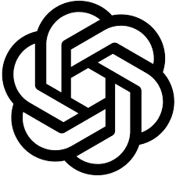

# GO2 
## My fist Python Project

Welcome to **My First Python Project**! This project is a simple demonstration of Python's capabilities, designed to help beginners understand basic programming concepts and improve their coding skills.

### Features

+ 🚀 Easy to use
  + you can use everything
+ 🎨 Well-organized code structure
+ 📈 Scalable and modular 
+ 🧩 Includes examples for common algorithms and data structures

[Created by ChatGPT](https://chatgpt.com)

 
